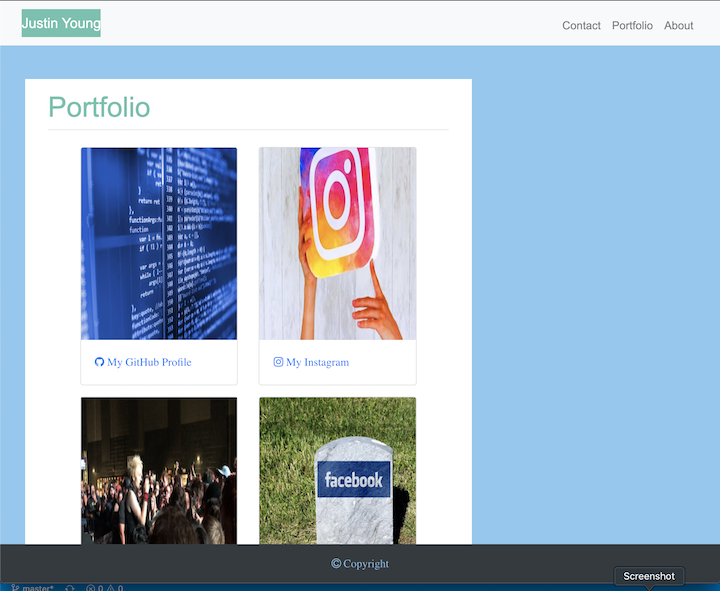
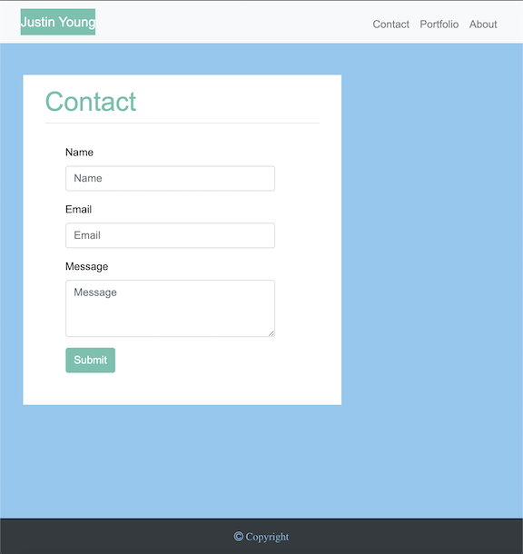
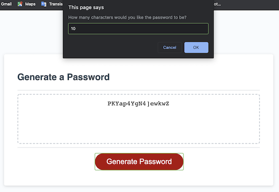

# full-stack-flex-training
This repository holds projects &amp; files that I used during playing around with different technologies and learning full stack development.

## hw1_justin_young
This folder contains simple HTML/CSS cleanup showing use of html symantics and use of organized, descriptive CSS and HTML tags.

## hw2_justin_young
This folder contains simple HTML/CSS pages using BootStrap4 and Font Awesome for responsive design to begin an "About Me", "Profile" web-site. (Like shown below).

## hw3_justin_young
This folder contains a simple random password generator, powered by Javascript (Like shown below).

